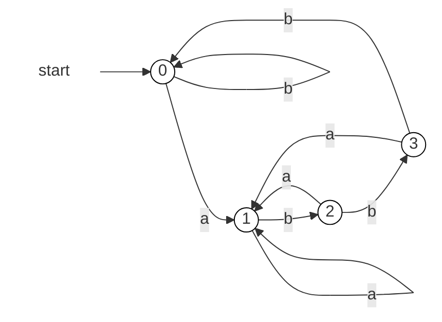
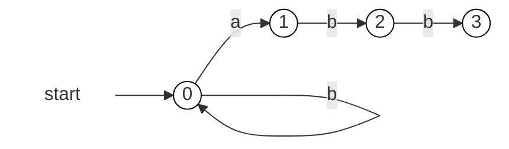
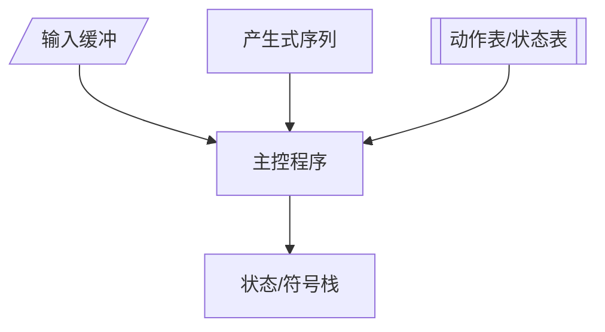

# 编译原理

## 1.2 编译器的结构

字符流 -> [词法分析器] -> 词法单元流 -> [语法分析器] -> 语法树 -> [语义分析器] -> 语法树 -> [中间代码生成] -> 中间表示形式 -> [机器无关代码优化器] -> 中间表示形式 -> [目标代码生成器] -> 目标机器语言 -> [机器相关代码优化器] -> 目标机器语言

> 前端：字符流 -> [词法分析器] -> 词法单元流 -> [语法分析器] -> 语法树 -> [语义分析器] -> 语法树 -> [中间代码生成]

> 中间表示：中间表示形式 -> [机器无关代码优化器] -> 中间表示形式

> 后端：[目标代码生成器] -> 目标机器语言 -> [机器相关代码优化器] -> 目标机器语言

> 语法制导翻译：[语法分析器] + [语义分析器] + [中间代码生成] 直接生成中间表示的编译方法

## 1.3 词法分析/扫描（Scanning）

> 词法单元（Token）：种别码 + 属性值

| 单词类型 | 种别                       | 种别码            |
| -------- | -------------------------- | ----------------- |
| 关键字   | if,else                    | 一词一码          |
| 标识符   | -                          | 多词一码          |
| 常量     | 整数、浮点数、字符串、布尔 | 一型一码          |
| 运算符   | 算术                       | 一词一码/一型一码 |
| ^        | 关系                       | ^                 |
| ^        | 逻辑                       | ^                 |
| 界限符   | ;(){}                      | 一词一码          |

## 1.4 语法分析（Parsing）

> 语法分析器（Parser）：从词法单元（Token）序列中识别出**各类短语**,并构造**语法分析树（Parse Tree）**

> 文法

## 1.5 语义分析

> 符号表（Symbol Table）

## 1.6 中间代码生成和编译器后端

> 语法结构树/语法树（Syntax Trees）（与语法分析树不同）

# 2 语言及其文法

## 2.1 基本概念

### 字母表上的运算

> 乘积（product）

> n次幂（power）

> 正闭包（positive closure）

> 克林闭包（Kleene closure）：空串（$\varepsilon$）+正闭包

> s的长度：$|s|$；例如：$|abc|=3$，$|\varepsilon|=0$

> 连接（concatenation）：x和y的连接=$xy$；例如：如果x=dog，y=house，则xy=doghouse；$\varepsilon s=s\varepsilon = s$；如果$x=yz$，则y是x的前缀，z是x的后缀

> 幂；$s^0=\varepsilon$；$s^n=s^{n-1}s,n \ge 0$

## 2.2 文法定义

文法：$G=(V_{T},V_{N},P,S)$
|         | 集合                      | 文法成分                   |
| ------- | ------------------------- | -------------------------- |
| $V_{T}$ | 终结符（terminal symbol） | 基本符号/token             |
| $V_{N}$ | 非终结符（nonterminal）   | 语法成分/语法变量          |
| $P$     | 产生式（production）      | 终结符与非终结符的组合方法 |
| $S$     | 开始符号（start symbol）  | 最大的语法成分             |

> $V_{T}\bigcap V_{N}=\Phi$；$V_{T}\bigcup V_{N}$：文法符号集

> 产生式（production）：$\alpha \to \beta$（读作$\alpha$定义为$\beta$）

> 候选式（candidate）；举例：$\alpha \to \beta _ 1 | \beta _ 2 | ...$；$\beta _ 1$等称为$\alpha$的候选式

---

举例：

$G=(\{id,+,*,(,)\},\{E\},P,E)$

$P=\{E \to E+E,E\to E*E,E\to(E),E\to id\}$

简写：

$G:E \to E+E|E*E|(E)|id$

---

**符号约定：**

终结符：$a,b,c$；串：$u,v,...,z$

非终结符：$A,B,C$

文法符号：$X,Y,Z$；串：$\alpha,\beta,...$

## 2.3 语言的定义

### 推导（Derivations）和规约（Reductions）

> 推导：用产生式的右部替换产生式的左部；规约：用产生式的左部替换产生式的右部

> **推导**：文法->非终结符串，记作$\Rightarrow^*$

> **规约**：非终结符串->文法

> **句型**：包含非终结符的文法符号串

> **句子**：不包含非终结符的句型

> **短语**：句型子串或句子子串

> **语言**的形式化定义：$L(G)=\{w|S\Rightarrow^*w,w\in V_{T}^*\}$

## 2.4 文法的分类

分类体系（Chomsky Hierarchy）：
* 0型文法（Type-0 Grammar）（无限制文法）（Unrestricted Grammar/Phrase-Structure Grammar，PSG）
* 1型文法（Type-1 Grammar）（上下文有关文法）（Context-Sensitive Grammar，CSG）
* 2型文法（Type-2 Grammar）（上下文无关文法）（Context-Free Grammar，CFG）
* 3型文法（Type-3 Grammar）（正则文法）（Regular Grammar，RG）
  * 左线性文法（Left-Linear Grammar）：$A \to aB|a$
  * 右线性文法（Right-Linear Grammar）：$A \to Ba|a$

## 2.5 CSG的分析树

> 分析树是推导的图形表示

> 边缘（frontier）（树的产出，yield）：从左到右的叶子结点的符号串

> 短语：子树的边缘

> 直接短语：只有父子两代的短语（一定是某产生式的右部；产生式的右部不一定是直接短语）

### 二义性文法

如果一个文法可以为某个句子构造出两棵不同的分析树，则称该文法是二义性的。

判断非二义性文法的充分条件：...

# 词法分析

## 3.1 正则表达式（Regular Expression，RE）

正则表达式是一种用来描述正则语言的更紧凑的表示方法。

正则表达式和正则文法是等价的：对于任何正则文法G，存在定义同一语言的正则表达式r；反之，对于任何正则表达式r，存在定义同一语言的正则文法G。

## 3.2 正则定义

## 3.3 有求自动机（Finite Automata，FA）

### FA模型

输入带（input tape）：用来存放输入符号串

读头（read head）：从左到右逐个读取输入符号串的字符，不能修改、不能往返移动

有穷控制器（finite control）：具有有限个状态，根据**当前状态**和**当前输入字符**决定**下一状态**

### FA的表示

转换图（transition graph）

### FA定义（接收）的语言

### 最长子串匹配原则

## 3.4 有穷自动机的分类

有穷自动机定义：$M=(Q,\Sigma,\delta,q_0,F)$

可以用转换表（transition table）表示有穷自动机

### 确定有穷自动机（Deterministic finite automata，DFA）

转换图：

### 非确定有穷自动机（Nondeterministic finite automata，NFA）

转换图：

非确定的有穷自动机的转换表中对于同一个输入字符，可能存在多个状态转换

### DFA和NFA的等价性

对于任何NFA M，存在定义同一语言的DFA M'，使得$L(M)=L(M')$

对于任何DFA M，存在定义同一语言的NFA M'，使得$L(M)=L(M')$

$正则文法 \Leftrightarrow 正则表达式 \Leftrightarrow FA$

### 带有$\varepsilon$转换的NFA

带有$\varepsilon$转换的NFA可以转换为不带有$\varepsilon$转换的NFA

## 3.5 从正则表达式到NFA

## 3.6 从NFA到DFA

DFA的每个状态都是由NFA的状态构成的**集合**，即**NFA状态集合的一个子集**

方法：子集构造法（subset construction）

# 4 语法分析

## 4.1 自顶向下分析（Top-Down Parsing）

> 最左推导（left-most derivation）：总是选择每个句型的**最左非终结符**进行替换

> 最右推导（right-most derivation）：总是选择每个句型的**最右非终结符**进行替换

> 最左推导的反向是最右规约
> 最右推导的反向是最左规约

> 在自底向上的分析中，总是采用最左归约的方式，因此把**最左归约**称为**规范归约**，而**最右推导**称为**规范推导**。

> 最左推导和最右推导的唯一性

> 自顶向下的语法分析采用最左推导方式

> 递归下降分析（Recursive-Descent Parsing）：由一组**过程**组成，每个过程对应一个**非终结符**

> 需要回溯的分析器叫做不确定的分析器

> 预测分析（Predictive Parsing）：**递归下降分析**的特例，通过在输入中向前看固定个数（通常是一个）符号来决定**当前应该使用哪个产生式**；不需要回溯，是一种确定的自顶向下分析方法

> **LL(k)**文法：可以构造出向前看k个符号的预测分析器

## 4.2 文法转换

> 问题1：同一非终结符的多个候选式存在共同前缀，将导致**回溯**现象

> 问题2：含有$A\to A\alpha$形式的产生式的文法称为**直接左递归**的（immediately left recursive）；如果一个文法中有一个非终结符A使得$A\Rightarrow^+A\alpha$，则称该文法是**左递归**的；经过两步或两步以上推导产生的左递归称为**间接左递归**

> 消除直接左递归：把左递归转换成右递归；会引入一些非终结符和$\varepsilon$产生式

> 消除间接左递归：把间接左递归转换成直接左递归，然后消除直接左递归

> 消除公共前缀：提取左公因子（Left Factoring）：通过改写产生式来**推迟决定**，等读入了足够多的输入，获得足够信息后再做出正确的选择

## 4.3 LL(1)文法

### S_文法（简单的确定性文法）
* 右部都以终结符开始
* 非终结符候选式首终结符都不同

> 什么时候使用$\varepsilon$产生式：如果当前某个非终结符A与当前输入符a不匹配时，若存在$A\to \varepsilon$，可以通过检查a是否可以出现在A的后面来决定是否使用$\varepsilon$产生式（若文法中无$A\to \varepsilon$，则应报错）

### 非终结符的后继符号集

可能在某个句型中紧跟在非终结符A后的终结符a的集合，记为$FOLLOW(A)$：

$FOLLOW(A)=\{a|S\Rightarrow^*\alpha A a \beta, a\in V_{T}, \alpha,\beta \in (V_{T}\bigcup V_{N})^* \}$

> 如果A是某个句型的最右符号，则结束符"$"添加到$FOLLOW(A)$中

### 产生式的可选集

产生式$A\to \beta$的可选集是指可以选用该产生式进行推导的输入符号串的集合，记为$SELECT(A\to \beta)$：

> $SELECT(A\to a\beta)=\{a\}$

> $SELECT(A\to \varepsilon)=FOLLOW(A)$

### q_文法
* 每个产生式右部为$\varepsilon$或以终结符开始
* 具有相同左部的产生式有不相交的可选集，*产生式右部需要非终结符开始*

### 串首终结符集

> 串首终结符：串首第一个符号，并且是终结符。简称首终结符

> 给定一个文法符号串$\alpha$，串首终结符集$FIRST(\alpha)$定义为可以从$\alpha$推导出的所有串首终结符构成的集合，如果$\alpha \Rightarrow \varepsilon$，则$\varepsilon$也在$FIRST(\alpha)$中

> 对$\forall \alpha \in (V_{T}\bigcup V_{N})^+$：$FIRST(\alpha)=\{a| \alpha \Rightarrow a\beta, a\in V_{T}, \beta \in (V_{T}\bigcup V_{N})^* \}$；
> 如果$\alpha \Rightarrow \varepsilon$，则$\varepsilon$也在$FIRST(\alpha)$中

如果$\varepsilon \notin FIRST(\alpha)$，$SELECT(A\to \alpha)=FIRST(\alpha)$

如果$\varepsilon \in FIRST(\alpha)$，$SELECT(A\to \alpha)=(FIRST(\alpha)-\{\varepsilon\})\bigcup FOLLOW(A)$

### LL(1)文法

文法G是LL(1)文法，当且仅当$G$的任意两个具有相同左部的产生式$A\to \alpha | \beta$满足下面的条件：
1. 如果$\alpha$或$\beta$不能推导出$\varepsilon$，则$FIRST(\alpha) \bigcap FIRST(\beta)=\emptyset$
2. $\alpha$和$\beta$至多有一个能推导出$\varepsilon$
3. 如果$\alpha \Rightarrow \varepsilon$，则$FIRST(\beta) \bigcap FOLLOW(A)=\emptyset$
4. 如果$\beta \Rightarrow \varepsilon$，则$FIRST(\alpha) \bigcap FOLLOW(A)=\emptyset$

> 目的：同一非终结符的各个产生式的**可选集互不相交**

> 可以为LL(1)文法构造预测分析器

LL1：
第一个L表示从左向右扫描；
第二个L表示最左推导；
1表示向前看一个输入来决定分析动作

## 4.4 FIRST集和FOLLOW集的计算

## 4.5 递归的预测分析法

## 4.6 非递归的预测分析法

根据预测分析表构造一个自动机，也叫做**表驱动的预测分析**或**下推自动机（Push Down Automata, PDA）**。

> 利用栈，其实思想和递归是一样的

### 预测分析法的实现步骤
1. 构造文法
2. 改造文法：消除二义性、消除左递归、消除回溯
3. 求每个变量的FIRST集和FOLLOW集，从而求得每个候选式的SELECT集
4. 检查是不是LL(1)文法，若是，则构造预测分析表
5. 对于递归的预测分析，根据预测分析表为每个非终结符编写一个过程；对于非递归的预测分析，实现表驱动的预测分析法

## 4.7 预测分析中的错误检测

## 4.8 自底向上的语法分析

## 4.9 LR分析法概述

LR文法是最大的、可以构造出相应移入-归约语法分析器的文法类。
L：对输入进行从左到右的扫描
R：反向构造出一个最右推导序列

LR(k)分析：需要向前查看k个输入符号的LR分析

> k=0和k=1具有实践意义，省略k时，k=1

### 基本原理

* 自底向上分析的关键问题
如何正确识别句柄
* 句柄是逐步形成的，用“状态”表示句柄识别的进展程度

LR分析器基于这样一些**状态**来构造**自动机**进行句柄的识别

### LR分析表

## 4.10 LR(0)分析

右部某位置标有圆点的产生式称为相应文法的一个**LR(0)项目**，简称**项目**

项目描述了句柄的状态

例如：
$S' -> ·bBB$ <- 移进/待约状态
$S' -> b·BB$ <- 待约状态
$S' -> bB·B$ <- 待约状态
$S' -> bBB·$ <- 归约状态
LR分析器基于这样一些**状态**构造**自动机**进行句柄的识别

### 增广文法
添加$S'\to S$，使分析器只有一个接受状态$S'\to S·$

### 后继项目

### 等价项目

把所有等价的项目组成一个项目集（I），称为**项目集闭包**（Closure of Item Sets），每个项目集闭包对应自动机的一个状态

## 4.11 LR(0)分析表的构造算法

$CLOSURE(I) = I \cup \{B\to \cdot \gamma | A\to \alpha \cdot B\beta \in CLOSURE(I),B\to \gamma \in P\}$

$GOTO(I,X) = CLOSURE(\{A\to \alpha X \cdot \beta | A\to \alpha \cdot X\beta \in I\})$

### 构造LR(0)自动机的状态集

规范LR(0)项目集族（Canonical LR(0) Collection）：
$C=\{I_0\} \bigcup \{ I | \exists J \in C,X\in V_{T}\bigcup V_{N} , I=GOTO(J,X) \}$

### 构造LR(0)分析表

1. 构造$G'$的规范LR(0)项集族$C=\{I_0,I_1,...,I_n\}$
2. 令$I_0$对应状态i。状态i的语法分析动作按照下面的方法决定：
   1. 如果$A\to \alpha \cdot a\beta \in I_i$且$GOTO(I_i,a)=I_j$，则$ACTION[i,a]=s_j$
   2. 如果$A\to \alpha \cdot B\beta \in I_i$且$GOTO(I_i,B)=I_j$，则$GOTO[i,B]=j$
   3. 如果$A\to \alpha \cdot \in I_i, A \neq S'$则$\text{for } \forall a \in V_{T} \bigcup \{\$\} \text{ do } ACTION[i,a]=rj, j \text{ is index of } A\to \alpha$
   4. 如果$S'\to S \cdot \in I_i$，则$ACTION[i,\$] = acc$
3. 分析表中没有定义的条目都设置为“error”

### LR(0)自动机的形式化定义

文法：$G=(V_{N},V_{T},P,S)$

LR(0)自动机：

$M=(C,V_{T}\bigcup V_{N},GOTO,I_0,F)$

$C=\{I_0\} \bigcup \{ I | \exists J \in C,X\in V_{T}\bigcup V_{N} , I=GOTO(J,X) \}$

$I_0=CLOSURE(\{S'\to \cdot S\})$

$F=\{CLOSURE(S'\to S \cdot)\}$

### LR(0)分析过程中的冲突

> 移进-归约冲突

> 归约-归约冲突

如果LR(0)分析表中没有冲突，则称该文法是LR(0)文法

## 4.12 SLR分析

基本思想：使用FOLLOW集来解决冲突

S指的Simple

### SLR分析表的构造

1. 构造$G'$的规范LR(0)项集族$C=\{I_0,I_1,...,I_n\}$
2. 令$I_0$对应状态i。状态i的语法分析动作按照下面的方法决定：
   1. 如果$A\to \alpha \cdot a\beta \in I_i$且$GOTO(I_i,a)=I_j$，则$ACTION[i,a]=s_j$
   2. 如果$A\to \alpha \cdot B\beta \in I_i$且$GOTO(I_i,B)=I_j$，则$GOTO[i,B]=j$
   3. （仅此处与LR(0)不同）如果$A\to \alpha \cdot \in I_i, A \neq S'$则$\text{for } \forall a \in FOLLOW(A) \text{ do } ACTION[i,a]=rj, j \text{ is index of } A\to \alpha$
   4. 如果$S'\to S \cdot \in I_i$，则$ACTION[i,\$] = acc$
3. 分析表中没有定义的条目都设置为“error”

如果SLR分析表中没有冲突，则称该文法是SLR文法

## 4.13 LR(1)分析

SLR分析存在的问题：SLR只是简单地考察下一个输入符号b是否属于规约项目$A\to \alpha$的相关联的$FOLLOW(A)$，但$b\in FOLLOW(A)$只是归约的一个必要条件，而非充分条件

### LR(1)分析法的提出

对于产生式$A\to \alpha$的归约，在不同的使用位置，$A$会要求不同的后继符号

在特定位置，$A$的后继符号集合是$FOLLOW(A)$的子集

### 规范LR(1)项目

将一般形式为$[A\to \alpha \cdot \beta,a]$的LR(1)项目称为**规范LR(1)项目**，其中$A\to \alpha \cdot \beta$是一个LR(0)项目，$a$是一个终结符（$视为特殊终结符），它表示在当前状态下，$A$后面必须紧跟的终结符，称为该项的**展望符**（lookahead）

> LR(1)中的1表示展望符的个数

> 对于[$A\to \alpha \cdot \beta,a$，如果$\beta \notin \varepsilon$，则展望符没有任何作用

### 等价LR(1)项目

### 

